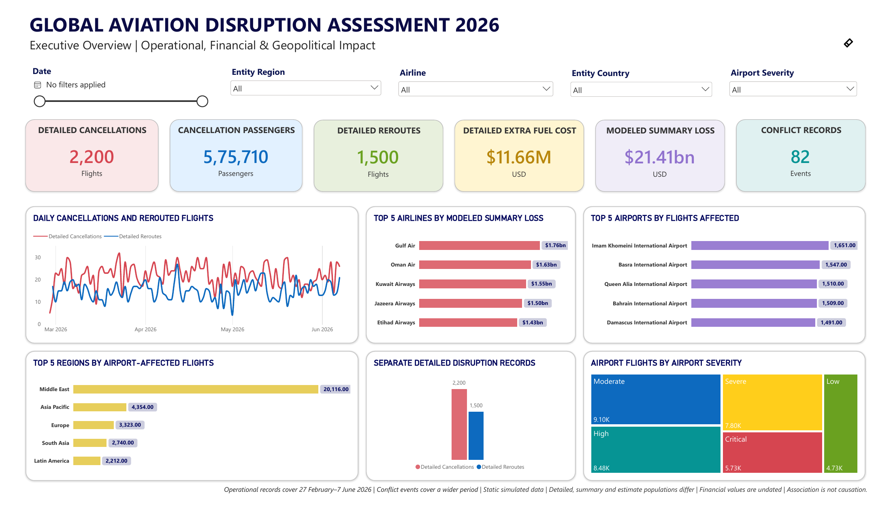

# Global Aviation Disruption Assessment 2026

An end-to-end business intelligence case study using **Python, PostgreSQL, SQL, and Power BI** to assess aviation disruption, passenger impact, regional exposure, and modeled airline losses.

The completed project turns seven source datasets into a reproducible analytical workflow and a four-page interactive report. It connects business requirements to data preparation, source-specific analysis, and practical planning recommendations.

> This is a simulated ICAO client assignment, not an official ICAO commission or endorsement. Results describe the supplied scenario rather than verified real-world aviation activity.

## Report preview



[View the complete report](visuals/PowerBI_SS/Global%20Aviation%20Disruption%20Assessment%202026%20DASHBOARD.pdf)

## What the project delivers

- **Executive Overview:** cancellation and reroute records, affected passengers, fuel cost, and airport exposure.
- **Modeled Financial Scenarios:** airline-loss rankings, daily estimates, and ratios within the appropriate financial population.
- **Geopolitical & Operational Disruption:** operational timelines, cancellation reasons, airport impact, and airspace closures.
- **Regional Risk & Aviation Corridor Vulnerability:** directional route burdens and separate regional airport, airspace, and financial comparisons.

## Key findings

- **Passenger impact:** 2,200 cancellation records contain 575,710 affected passengers.
- **Reroute burden:** 1,500 reroute records add 2.20 million kilometres, USD 11.66 million in fuel cost, and 4,706.30 delay hours.
- **Regional concentration:** the Middle East accounts for 56.12% of airport-affected flights and, separately, 77.85% of modeled summary airline loss.
- **Corridor concentration:** Europe to Middle East leads reroute activity with 196 records. The reverse direction leads regional-corridor cancellations with 251 records.

These findings support targeted contingency reviews, passenger-support planning, and separate financial scenario discussions. The case study explains the evidence behind each recommendation.

## Technical approach

```text
Raw CSV files → Python validation and cleaning → Clean UTF-8 files
→ PostgreSQL tables → SQL analysis and views → Power BI Import model
```

The implementation contains seven ETL scripts, shared validation helpers, seven analytical tables, six SQL analysis scripts, and nine views. The Power BI model uses explicit measures and separate date, airline, geography, and severity dimensions.

A key modeling decision is to preserve different source populations. Detailed cancellations and reroutes are not forced to match financial summary counts. Airport and airspace exposures remain separate, and undated financial values are not presented as dated operational trends.

See the [architecture](visuals/Architecture/Project%20Architecture.png) and [database and semantic-model diagram](visuals/ERD/ERD%20-1.png).

## Documentation

- [Business Requirements](documentation/Business%20Requirements.docx): client brief, 24 questions, scope, and acceptance criteria.
- [Preliminary Data Assessment](documentation/Preliminary%20Data%20Assessment.docx): source coverage, quality checks, and preparation decisions.
- [Technical Documentation](documentation/Technical%20Documentation.docx): transformations, SQL objects, final Power BI model, and reproduction instructions.
- [Executive Case Study](documentation/Executive%20Case%20Study.docx): completed findings, dashboard pages, and recommendations.

## Run locally

Clone the full repository. Use Python with `requirements.txt`, PostgreSQL with `psql`, and Power BI Desktop with PBIP support. Follow the technical document for the setup order, then open the PBIP project and connect to your local `aviation_bi` database. Database setup includes destructive rebuild steps; use a dedicated local project database. Never store credentials in the repository.

## Source and licenses

Data: [Global Civil Aviation Disruption 2026 Iran–US War](https://www.kaggle.com/datasets/zkskhurram/global-civil-aviation-disruption2026-iranus-war), attributed under **CC BY-SA 4.0**. Code: [MIT](LICENSE). The code license does not replace the dataset license.

**Authors:** Dhaerya Nauni and Honey Aggarwal